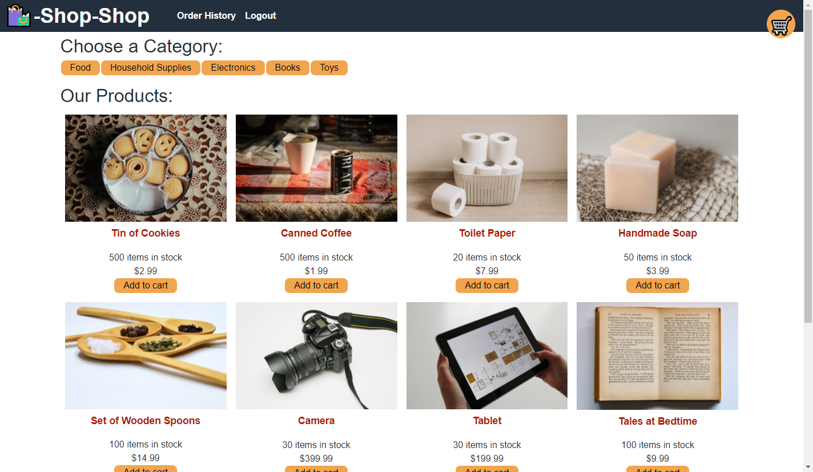
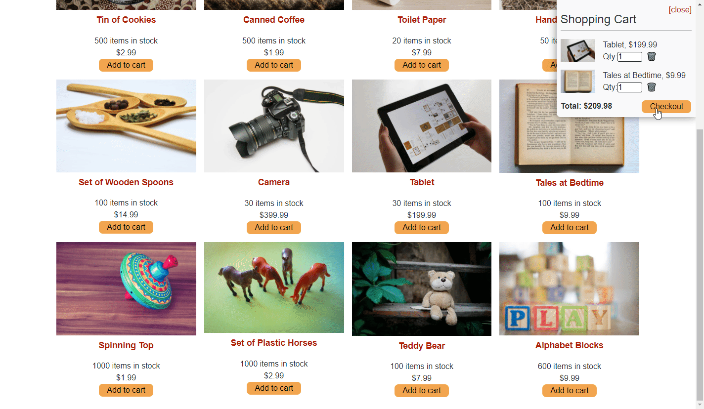

# **Book Search and Save**
 &emsp;&emsp;

&nbsp;
## **Table of Contents**
  - [**Description**](#description)
  - [**Live Application**](#live-application)
  - [**Application Screenshots and Demo**](#application-screenshots-and-demo)
  - [**Technologies and Services**](#technologies-and-services)
  - [**License**](#license)

&nbsp;
## **Description**
This ecommerce store application was provided as a functioning full stack MERN application using the React context API to manage state at the global level. This app was refactored to replace use of the [context API](https://reactjs.org/docs/context.html) for global state management with [Redux](https://redux.js.org/) using the redux and react-redux npm packages. 

The web application is hosted on Heroku for demonstration. 

&nbsp;
## **[Live Application](https://spf-redux-store.herokuapp.com/)**
## **Application Screenshots and Demo**

&nbsp;
## **Technologies and Services**
Development Technologies
- Database/Models: MongoDB, Mongoose (ODM)
- Client: React, Redux, Apollo Client, Stripe API
- Server/APIs: Node.js, Express.js, GraphQL (Apollo Server)

External Frameworks, Services, and Credits
- [Bootstrap CSS Framework](https://getbootstrap.com/)
- Favicon [book icon](https://icons8.com/icons/set/shop) from [Icons8](https://icons8.com/)

&nbsp;
## **License**
Licensed under the [MIT](./LICENSE) license.

